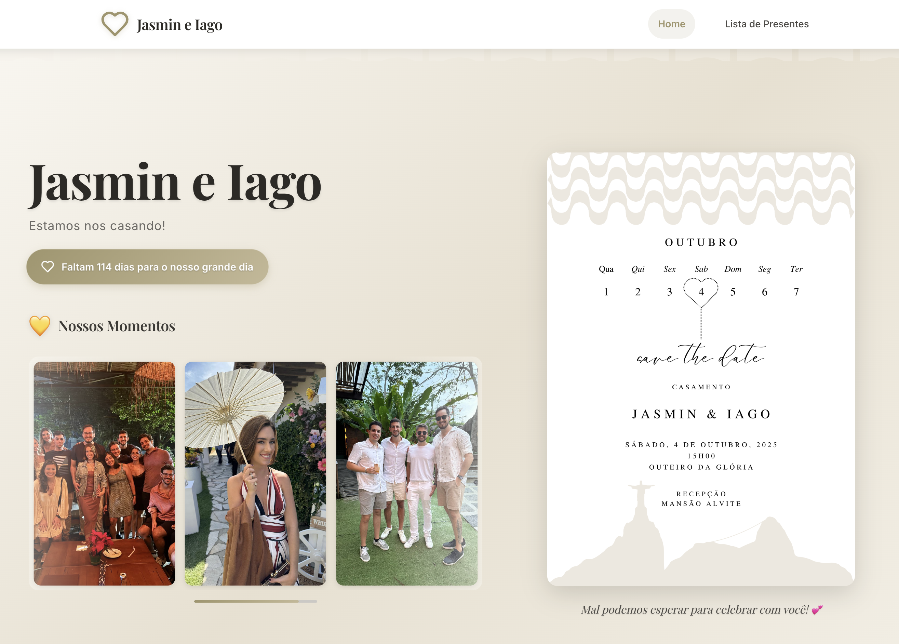

# 💕 Wedding Website - Iago & Jas

A working, modern and elegant wedding website built with React and TypeScript. The project features an emotional landing page and an interactive categorized gift list with integrated payment solutions.

[Access the site here](https://casamento-jas-e-iago.com)

## ✨ Features

### 🏠 Landing Page

- Hero section with couple photos and save the date
- Wedding venue information
- Responsive design optimized for all devices

### 🎁 Gift List

- Interactive gift categories with detailed modals
- Multiple payment options integration
- WhatsApp communication integration

## 📸 Screenshots

### Landing Page


_Modern and elegant landing page with hero section and wedding details_

### Gift List Page


_Interactive gift list with categorized items and smooth animations_

### Gift Components

| Gift Card                                               | Gift Details & Payment                                        |
| ------------------------------------------------------- | ------------------------------------------------------------- |
|             |             |
| _Individual gift card with image and basic information_ | _Expanded gift view with payment options and PIX integration_ |

## 🛠️ Tech Stack

### Core Technologies

- React 18.2.0 with TypeScript 5.2.2
- Vite 5.4.19 for build and development
- React Router DOM 6.20.1 for navigation
- CSS Modules with custom properties for theming

### Payment Integration

- Stripe integration for credit card processing
  - Buy Button implementation
  - Installment options support
- PIX (Brazilian instant payment) via QR Code
- Pagar.me gateway for Brazilian installment payment processing

#### Payment Links Setup

- Stripe Payment Links for quick checkout
  - Create payment links in Stripe Dashboard
  - Customize branding and payment options
  - Support for multiple currencies
  - Automatic receipt generation
  - Track payment status in real-time

### UI/UX

- Custom component library
- Lucide React for icons
- Compound Components pattern
- Apple-inspired design system
- Responsive design with mobile-first approach

### Development & Quality

- ESLint with TypeScript and React plugins
- Strict TypeScript configuration

- Path mapping for clean imports
- Hot Module Replacement (HMR)

### Communication

- EmailJS for email notifications
- WhatsApp Business API integration

## 📁 Project Structure

```
src/
├── components/
│   ├── ui/                     # Reusable base components
│   └── features/               # Feature-specific components
├── pages/                      # Application pages
├── types/                      # TypeScript definitions
├── data/                       # Gift data
└── styles/                     # Global styles

public/
├── assets/                     # General assets
└── gifts/                      # Gift-specific assets
```

## 🚀 Getting Started

```bash
# Installation
npm install

# Development
npm run dev

# Production Build
npm run build

# Linting
npm run lint
```

## 🎨 Customization

The project uses CSS custom properties for easy theming and customization. All payment integrations are configurable through environment variables.

## 🚀 Deployment

The project is optimized for static deployment and can be easily deployed to:

- Vercel

## 📄 License

Personal project for Iago & Jas wedding.

---

Made with 💕 to celebrate our love!
